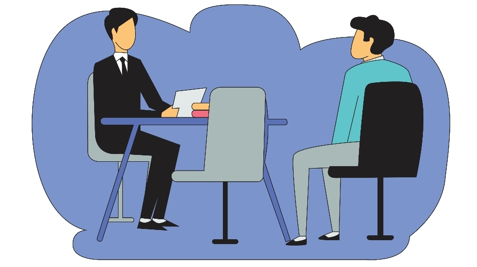
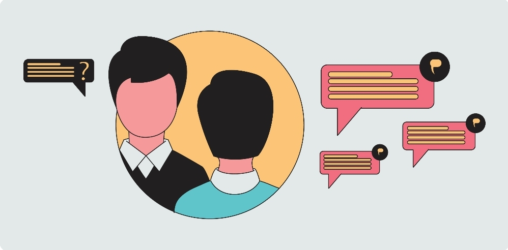
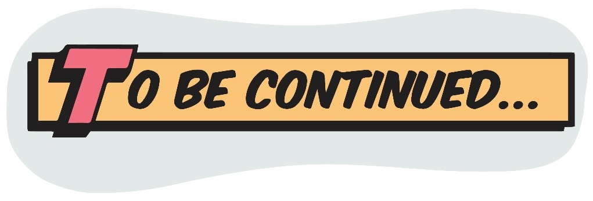

## Advanced Java Interview Material

## Q.1) What is the difference between execute, executeQuery, executeUpdate in JDBC?

### Answer:
## execute:
The execute statement is used to 1 execute an SQL query and it returns TRUE if the result is a ResultSet such as running Select queries. The output is FALSE when there is no ResultSet object such as running Insert or Update queries.
## executeQuery: 
The executeQuery statement is used to execute select queries and returns 2 the ResultSet. The ResultSet returned is never null even if there are no records matching the query.
## executeQuery: 
The executeQuery statement is used to execute select queries and returns 2 the ResultSet. The ResultSet returned is never null even if there are no records matching the query.
## executeUpdate: 
The executeUpdate statement is used to execute insert/update/delete (DML) statements or DDL statements 3 that return nothing. The output is an integer value that equals the row count for SQL Data Manipulation Language (DML) statements. For DDL statements, the output is 0.
You should use the execute() method only when you are not sure about the type of statement, else use the executeQuery or executeUpdate method.

## Q.2) What are the FileInputStream and FileOutputStream?
### Answer: 
Java FileOutputStream is an output stream used for writing data to a file. If you have some primitive values to write into a file, use *FileOutputStream* class. You can write byte-oriented as well as character-oriented data through the *FileOutputStream* class However, for character-oriented data, it is preferred to use *FileWriter* than *FileOutputStream*. Consider the following example of writing a byte into a file.

*Java FileInputStream* class obtains input bytes from a file. It is used for reading byte-oriented data (streams of raw bytes) such as image data, audio, video, etc. You can also read character-stream data.

However, for reading streams of characters, it is recommended to use FileReader class. Consider the following example for reading bytes from a file.

## Q.3) What are the steps that are followed when two computers connect through TCP?
### Answer: 
The following steps are performed when two computers connect through TCP:

1) The ServerSocket object is instantiated by the server which denotes the port number to which the connection will be made.
2) After instantiating the ServerSocket object, the server invokes accept() method of ServerSocket class which makes the server wait until the client attempts to connect to    the server on the given port.
3) While the server is waiting, a socket is created by the client after instantiating the Socket class. The socket class constructor accepts the server port number and         server name.
4) The Socket class constructor attempts to connect with the server on the specified name. If the connection is established, the client will have a socket object that can communicate with the server.
5) The accept() method invoked by the server returns a reference to the new socket on the server that is connected with the server.

## Q.4) What are autoboxing and unboxing? When does it occur?
### Answer: 
The autoboxing is the process of converting primitive data type to the corresponding wrapper class object, for example, int to Integer. The unboxing is the process of converting wrapper class objects to primitive data types, for example, integer to int Unboxing and autoboxing occur automatically in Java. However, we can externally convert one into another by using methods like valueOf() or xxxValue(). It can occur whenever a wrapper class object is expected, and a primitive data type is provided, or vice versa, Adding primitive types into Collection like ArrayList in Java.
Creating an instance of parameterized classes Java automatically converts primitives to objects whenever one is required and another is provided in the method calling.
When a primitive type is assigned to an object type.

## Q.5) What do you understand from JDBC Statements?

### Answer: 
JDBC statements are used to send SQL commands to the database and retrieve data back from the database. Various methods like execute(), executeUpdate(), executeQuery, etc. are provided by JDBC to interact with the database

*JDBC supports three types of statements,*

### Statement:
Used for general-purpose access 1 to the database and executes a static SQL query at runtime.
2
### PreparedStatement: Used to provide input
### parameters to the query during execution.

### allableStatement: Used to access the 3 database stored procedures and helps in accepting runtime parameters.

