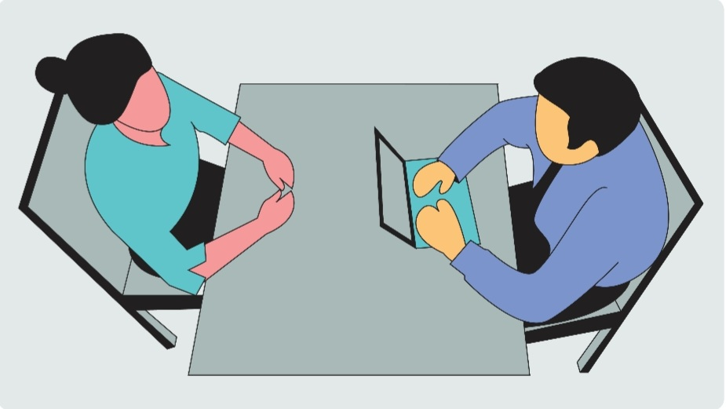

### Q.1.) What is a package in Java? List down various advantages of packages.

### Answer:
Packages in Java are the collection of related classes and interfaces which are bundled together. By using packages, developers can easily modularize the code and optimize its reuse. Also, the code within the packages can be imported by other classes and reused.

### *Below listed are a few of its advantages,*

1) Packages help in avoiding name clashes.
2) They provide easier access control on the code.
3) Packages can also contain hidden classes which are not visible to the outer classes and only used within the package.
4) Creates a proper hierarchical structure which makes it easier to locate the related classes.

### Q.2.) What is the difference between throw and throws in Java?

### Answer:
Throw keyword is used to throw an exception explicitly in the program inside a function or inside a block of code. Throws is a keyword used in the method signature to declare an exception that might get thrown by the function while executing the code.

### Q.3.) What is the "this" keyword in Java?

### Answer: 
The "this" keyword is a reference variable that refers to the current object. There are various uses of the "this" keyword in Java. It can be used to refer to current class properties such as for instance methods, variables, constructors, etc.
It can also be passed as an argument into the methods or constructors. It can also be returned from the method as the current class instance.

### Q.4.) Can you state the difference between checked and unchecked exceptions in Java?

### Answer: 
A checked exception is checked by the compiler at compile time. It's mandatory for a method to either handle the checked exception or declare them in their throws clause.
These are the ones that are a subclass of Exception but don't descend from RuntimeException. The unchecked exception is the descendant of RuntimeException and not checked by the compiler at compile time.

### Q. What is a HashMap in Java?

### Answer: 
HashMap is a Map-based collection class that is used for storing key & value pairs, it is denoted as HashMap<Key, Value> or HashMap<K, V>. This class makes no guarantees for the order of the map. It is similar to the Hashtable class except that it is unsynchronized and permits nulls (null values and null key).

